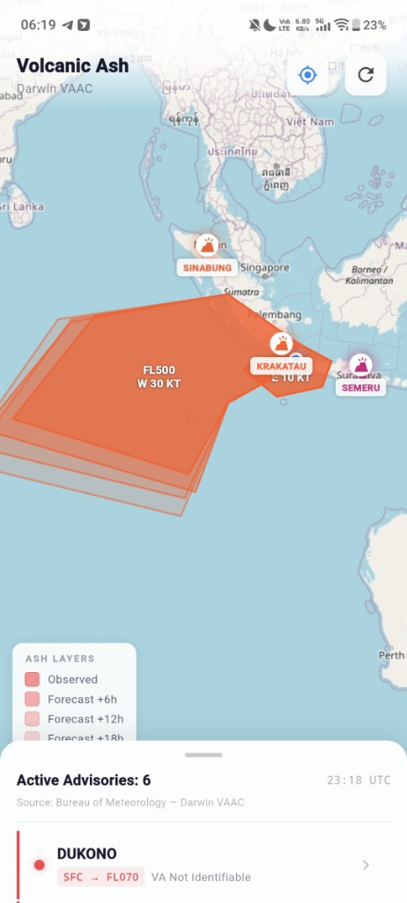
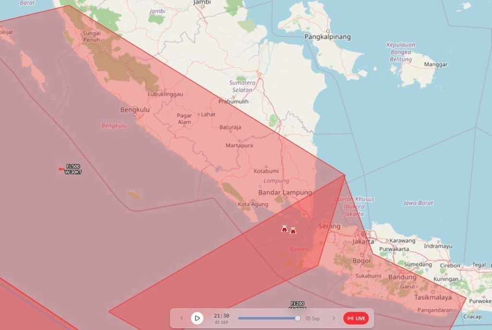

# 🌋 AshWatch — Darwin VAAC Volcanic Ash Advisory Viewer

<div align="center">


**A professional, portfolio-grade Flutter application that visualizes real-time volcanic ash advisories (VAA) from the Australian Bureau of Meteorology (BoM) Darwin VAAC across Indonesia on an interactive OpenStreetMap.**

[Key Features](#-features) • [Screenshots](#-screenshots) • [Architecture](#-architecture) • [Getting Started](#-getting-started) • [Testing](#-testing)

</div>

---

## 📸 Screenshots

<div align="center">

| 🌋 Live Ash Polygons & Spread | 🗺️ Aviation Flight Levels & Tracking |
|:---:|:---:|
|  |  |
| *Real-time Krakatau ash cloud spread (FL500 West / FL200 East) over Sumatra & Java* | *Darwin VAAC dispersion model alignment* |

</div>

<br/>

<div align="center">

| 📍 Fitur Utama | 📱 Deskripsi Visual |
|---|---|
| **Multi-Altitude Ash Layers** | Visualisasi poligon abu vulkanik bertingkat (Observed, Forecast +6h, +12h, +18h) dengan label Flight Level dan arah gerak angin (`FL500 W 30KT`). |
| **Pulsing GPS User Location** | Marker lokasi pengguna berdenyut (seperti Google Maps) dengan tombol re-center instan dan izin runtime otomatis (Android < 12 & Android 12+). |
| **Adaptive Theme (Dark/Light)** | Seluruh panel, top bar, dan kartu informasi adaptif mengikuti tema sistem dengan kontras tinggi. |
| **Interactive Volcano Focus** | Mengetuk nama gunung pada panel bawah otomatis menggeser dan mengarahkan zoom kamera peta langsung ke gunung tersebut. |

</div>

---

## ✨ Features

- **🌐 100% Serverless & Direct BoM Ingestion**:
  Aplikasi terhubung langsung ke feed publik BoM Darwin VAAC tanpa backend perantara (Zero Node.js, Go, Laravel, maupun DB).
- **🌋 Multi-Volcano & Multi-Advisory Support**:
  Mendukung dan menampilkan seluruh gunung api aktif di Indonesia secara bersamaan (Krakatau, Semeru, Lewotolok, Ibu, Dukono, dll.).
- **🧩 Multi-Altitude Sub-Polygon Parsing**:
  Mampu membedah beberapa lapisan ketinggian poligon dalam satu seksi `OBS VA CLD` (contohnya letusan Krakatau dengan lapisan `SFC/FL200` bergerak ke Timur dan `SFC/FL500` bergerak ke Barat).
- **📐 Aviation Coordinate Conversion**:
  Parser presisi tinggi yang mengonversi format koordinat penerbangan internasional (`DDMM` lat & `DDDMM` lon) ke nilai desimal derajat.
- **🗺️ Interactive Map with Auto-Bounds**:
  Peta berbasis `flutter_map` (OpenStreetMap) yang otomatis menyesuaikan area pandang (*fit bounds*) ke seluruh sebaran abu vulkanik aktif di Indonesia.
- **🎨 Deterministic Palette**:
  Setiap gunung berapi memiliki warna identifikasi yang konsisten berdasarkan hash nama gunung.
- **🔄 Smart Silent Auto-Refresh**:
  Pembaruan data otomatis setiap 10 menit di latar belakang tanpa mengganggu interaksi peta pengguna.

---

## 🏗️ Architecture

Aplikasi dibangun menggunakan prinsip **Clean Architecture** yang terbagi ke dalam 4 lapisan independen:

```
lib/
├── core/                        # Utilitas inti dan parser
│   ├── network/                 # Konfigurasi koneksi
│   ├── parser/                  # Parser teks VAA & konversi koordinat
│   │   ├── coordinate_parser.dart   # Parser koordinat DDMM/DDDMM
│   │   ├── html_extractor.dart      # Ekstraksi blok <pre> dari HTML BoM
│   │   └── vaa_parser.dart          # Parser komprehensif format VAA
│   └── utils/
│       └── date_utils.dart          # Penanganan timestamp UTC / DTG
├── data/                        # Data layer
│   ├── datasources/             # Remote datasource (HTTP ke BoM)
│   │   └── bom_remote_datasource.dart
│   ├── models/                  # Model data & entity mapping
│   │   └── volcano_advisory.dart    # VolcanoAdvisory & AshPolygon
│   └── repositories/            # Implementasi repository
│       └── vaa_repository_impl.dart
├── domain/                      # Domain layer (Business Logic)
│   ├── repositories/            # Kontrak repository abstrak
│   │   └── vaa_repository.dart
│   └── usecases/                # Use case interactor
│       └── get_active_advisories.dart
└── presentation/                # UI Layer
    ├── blocs/                   # State management BLoC
    │   └── darwin_vaa_bloc.dart
    ├── pages/                   # Halaman utama
    │   └── map_page.dart            # Peta OSM, top bar, & bottom sheet
    └── widgets/                 # Komponen UI modular
        ├── advisory_detail_sheet.dart  # Modal detail advisory
        ├── ash_polygon_layer.dart      # Renderer poligon & marker
        ├── empty_view.dart             # Status kosong
        ├── error_view.dart             # Status error jaringan
        ├── map_legend.dart             # Legenda floating
        └── volcano_list_tile.dart      # Item tile daftar gunung
```

---

## 🔬 Technical Engineering Highlights

### 1. Robust VAA Text Parsing
Format VAA dari BoM memiliki karakteristik khusus: pemisah baris `\r\r\n` dan *continuation lines* yang menjorok dengan spasi banyak. Parser dinormalisasi untuk:
- Menggabungkan baris lanjutan koordinat yang terpotong tanpa merusak struktur seksi.
- Mengabaikan token kecepatan angin (`MOV W 30KT`) agar tidak salah terbaca sebagai titik poligon.
- Mengekstrak beberapa sub-poligon sekaligus berdasarkan batas token Flight Level (`(SFC|FL\d+)\s*/\s*(SFC|FL\d+)`).

### 2. Time & Date Handling
Timestamp VAA menggunakan format UTC (`20260905/2230Z` atau `06/0410Z`). Seluruh penanggalan diproses murni dalam UTC dan hanya dikonversi ke waktu lokal saat ditampilkan ke pengguna.

---

## 🚀 Getting Started

### Prasyarat
- [Flutter SDK](https://flutter.dev) (versi `^3.13.2` atau terbaru)
- Android Studio / VS Code dengan ekstensi Flutter & Dart
- Perangkat fisik Android atau Emulator

### Instalasi & Menjalankan

1. **Clone repositori:**
   ```bash
   git clone https://github.com/your-username/ashwatch.git
   cd ashwatch
   ```

2. **Pasang dependensi:**
   ```bash
   flutter pub get
   ```

3. **Jalankan aplikasi:**
   ```bash
   flutter run
   ```

---

## 🧪 Testing

Proyek ini dilengkapi dengan cakupan unit test komprehensif untuk memastikan keandalan parser terhadap berbagai format dan variasi data cuaca penerbangan.

Jalankan seluruh test:
```bash
flutter test
```

Hasil pengujian:
```text
00:00 +48: All tests passed!
```

Cakupan test meliputi:
- Konversi komponen koordinat (N, S, E, W, menit ke desimal derajat)
- Ekstraksi poligon dan eksklusi token pergerakan angin (`MOV`)
- Ekstraksi beberapa sub-poligon dalam 1 seksi (kasus Krakatau multi-layer)
- Deduplikasi gunung api (mengambil advisory terbaru per gunung)
- Filter wilayah Indonesia (`AREA: INDONESIA`)
- Penanganan `NO VA EXP`, `VA NOT IDENTIFIABLE`, dan respon kosong / malformed

Analisis statis kode:
```bash
flutter analyze
# No issues found!
```

---

## 📡 Sumber Data

Data abu vulkanik bersumber langsung dari:
- **Bureau of Meteorology (BoM) — Darwin Volcanic Ash Advisory Centre (VAAC)**
- Produk publik: [Volcanic Ash Advisories (Last 7 Days)](https://www.bom.gov.au/products/Volc_ash_recent.shtml)

---

## 📄 Lisensi

Didistribusikan di bawah Lisensi MIT. Lihat `LICENSE` untuk informasi lebih lanjut.
